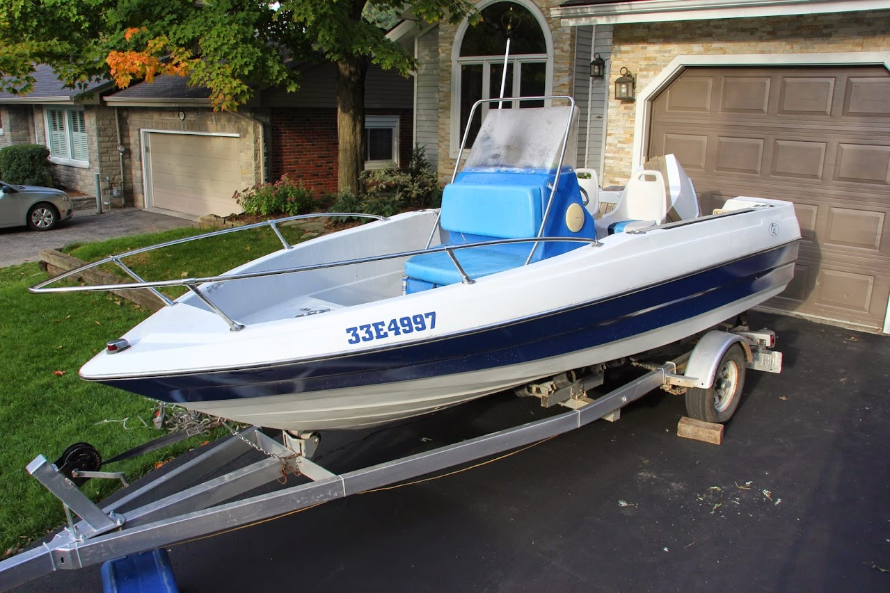
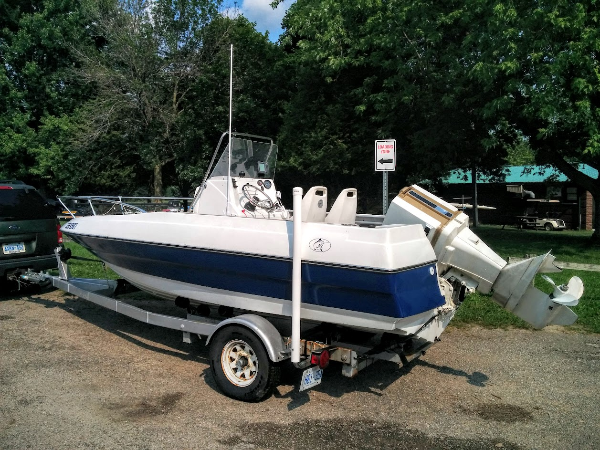

Once upon a time there was an old boat with a soft transom, and waterlogged flotation foam, and pretty much rotten everything. This is the journey 
from this: 

 

to this

 

The entire build was [documented on iboats.com](https://forums.iboats.com/threads/88-bayliner-trophy-1710-wet-foam-and.639350/).
